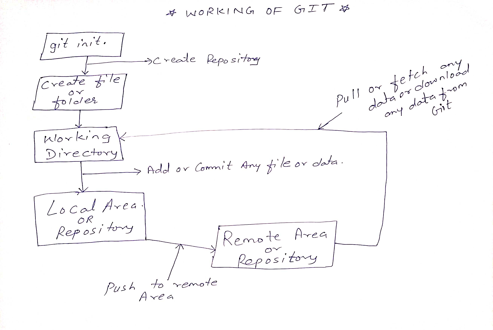

**Working of Git**
Relative path: 

### Git and basic building block ###
 
**What is git.**

- Git is open source software and distributed version control system
- It is like recording or managing of anything in systematic and easier manner.
- It used for tracking or coordinating of work with two or more than two system at same time. Eg. Developing software
- It is like tree system, It includes speed, data integrity, file security etc.

### Stages of Git ###
- Working Directory (Local machine)
- Staging area (It belogs to Local machine)
- Commit and Push to Remote Repository( From local machine to remote machine)
- Remote Repository (Github)

**Centralized Version Control system**

- In this all system are connect with Central System to share works with each others.
- It works online only 
 **Eg.**Microsoft Team Foundation Server

**Distributed Version Control system**

- It means track and manage anything from local machine to remote machine
- It works online as well as offline. 
 **Eg.** Git

### Commands ###
- **git :**		It is a third part command
- **git init:** 	It create empty repository
- **git touch < filename >:** 	to create new file
- **git add < filename >:**	Adding file into git repository(remote system)
- **cat >  <anything>:**	Adding anything into file just for one time, if we again run this command then it override it
- **cat >>  < anything >:** 	Adding anything into file, it does not override if we again run this comand
- **Git nano< filename >:**  	It shows contents of file, we can edit that contents
- **git add < filename >:** 	It add file into repository
- **git add . or***     		It add multiple file at a time into repository
- **git show:**		It shows history after commit
- **git status:**      			It check the current status of file
- **red text:**	It shows untracted file
- **green text:**	It shows changes but not commited yet
- **git diff < filename >:** 		It shows history before commit
- **Green text:** 	It shows added  part or content
- **Red text:**	It shows removed part or content
- **git show < any committed_ID > :**	It shows history of commited_ID
- **git commit -m"Any message":**   Commit the file so that it store in git 
- **git log:** 	 It shows all committed ID's date’s and userid’s of who commited. Or we can say it shows history 
 **+content:**	It means this content  is added to existing file 
 **-content:**   	It means this content  is removed from existing file 
	
  

### Existing Repository command ###

- **git –version :**				It shows the version of git and git is installed or not
- **git push origin master:** 		push code to main link at master branch
- **git clone< url of repository >:**  	access the repository in local system
- **git fetch origin< branchname >:** 	To fetch new data from repository
- **git pull origin < branchname >:**  	To fetch new data from repository
- **git reset HEAD < file name >:**	It reset From stagged to untracked stage
- **git rm :**				remove file from working tree.
- **git reset:** 				It goes one step back
- **git stash :**			 It saves file or data into another location or it moves file or data to another location.
- **git stash pop:**		 It fetch file or data from where it saved to local machine
- **git merge < branchname>:**	 In current brach new branch will be merge 
 **Eg. git merge learngit:**  	 learngit branch will merge in current branch

### Branches ###

- **git branch:** 				It shows all branch and current active branch in green color
- **git branch -r:**                   		It shows list of remote branch
- **git branch --merged:**                       It shows list of merged branches 
- **gir branch < branch_name>:** 	It create new branch 
- **git checkout -b < branch_name >:**   It create and switch to new branch
- **git merge < branch name>:** 		Current branch merge into new branch 
- **Eg. git merge deepak:**   		Current branch will merge in deepak branch
- **git branch –d/_D < branch name>:** For deleting any branch
- **git checkout < branch name>:**	It switch branch fron current to new branch 
 **Eg.  git checkout learngit:**  	It now switch to learngit branch

### Conflict ###
- when more than one same file name are pushed into the remote repository then conflicts occurred
- At the time of pushing any file if file is already exists in repository then it shows the contents of existing file as well as new file so that time we have to decide which content should be pushed in repository.
- It can be user 1 contents 
 Or 
- It can be user 2 contents 
Or
- Both users contents can be pushed

